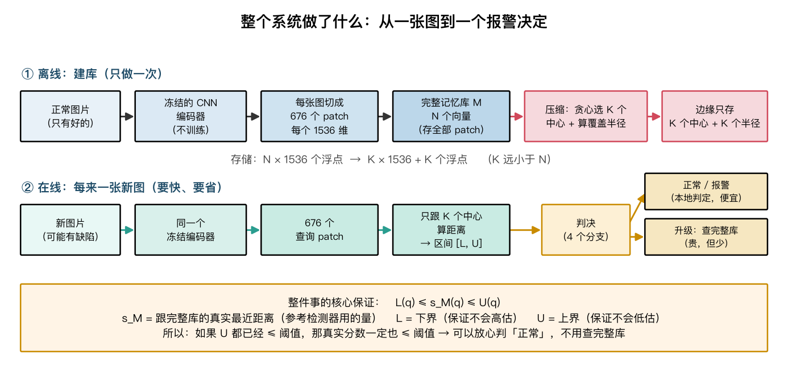
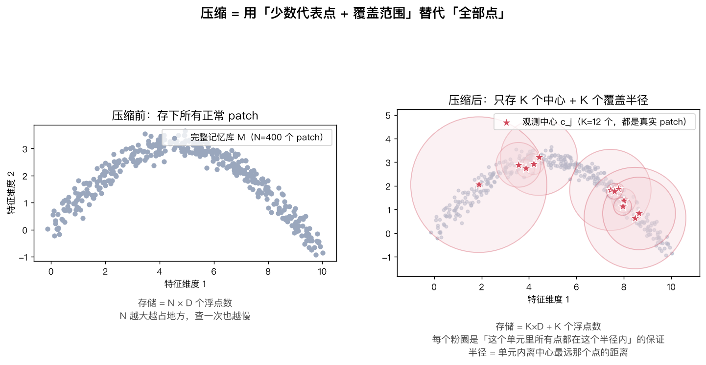
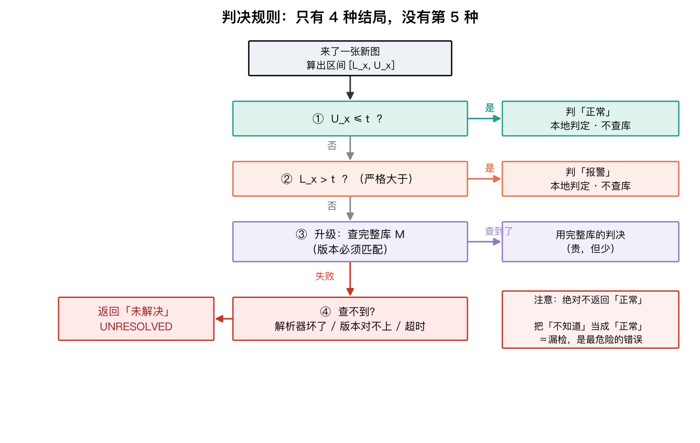
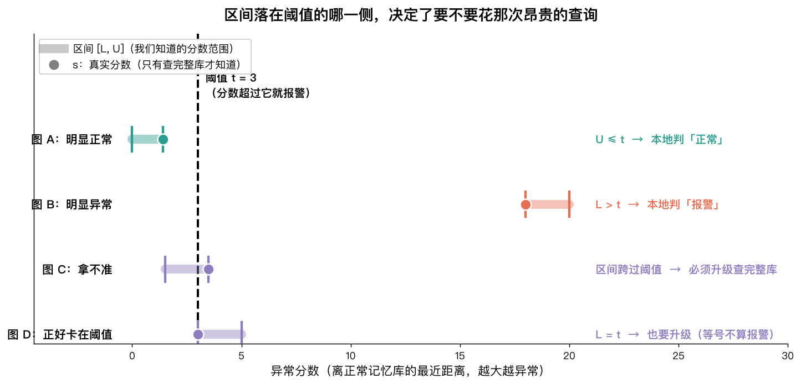
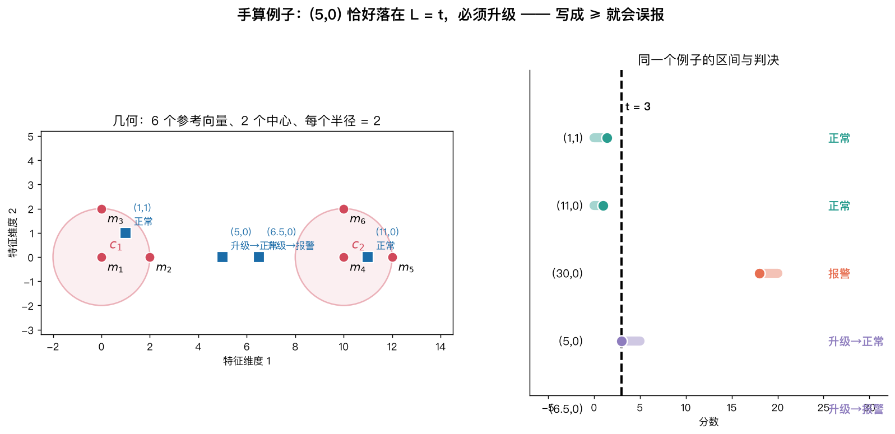
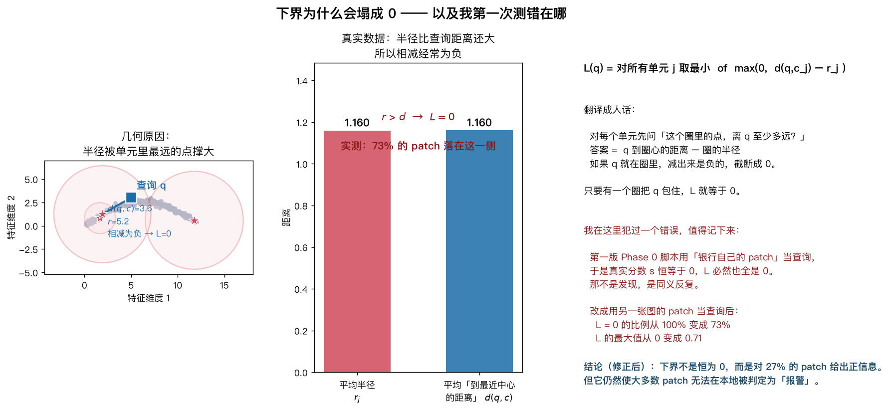
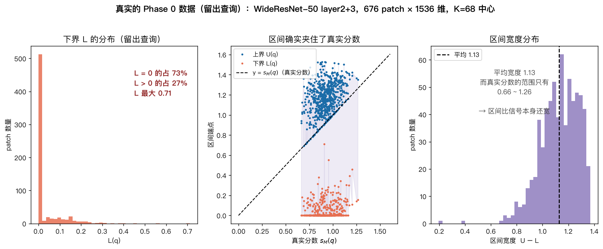

# 这个项目到底在干什么 —— 从零开始的图解说明

**写给 / For:** 刚进入这个方向、还没做过异常检测研究的自己
**日期 / Date:** 2026-10-08
**所有图由 `make_figures.py` 生成，第 6、7 张用的是真实骨干特征，不是示意图。**

```bash
.venv/bin/python docs/tutorial/make_figures.py   # 重新生成全部图
```

---

## 第 0 步：先说清楚"工业异常检测"是什么问题

想象你是工厂质检员，流水线上生产金属罐。你的任务是：**判断这个罐子有没有缺陷**。

难点在于：

- **好的罐子长得都差不多，但坏的样子有无数种。** 凹痕、划痕、污渍、变形……
  你不可能事先收集齐所有缺陷类型。
- **所以你反过来做：只学"好的长什么样"。** 任何跟"好的"差得比较多的，
  就算异常。这在学术上叫 **one-class / 无监督异常检测**。
  MVTec AD 这个数据集就是干这个的：15 类产品，每类给一堆**只有正常品**的训练图，
  然后拿有缺陷的测试图来考你。

**本项目用的方法叫"记忆库 + 最近邻"**，思路非常朴素：

> 把训练时见过的**所有正常图像块（patch）**都存起来。
> 来一张新图，就把它切成同样大小的块，逐块去问：
> "你跟我存过的正常块里最近的那个，有多远？"
> 差得越远，越可能是缺陷。

这个"距离"就是**异常分数**。分数超过一个**阈值 t**，就报警。

---

## 第 1 步：整张图是怎么流的



分两段看：

**① 离线（建库，只做一次）**

1. 拿一堆**只有正常品**的图片。
2. 过一个**冻结的** CNN 编码器（本项目用 WideResNet-50）。
   "冻结"的意思是：**完全不训练**，只用它 ImageNet 预训练好的权重。
   这很重要——如果编码器会变，就谈不上"保持原检测器"了。
3. 每张图被切成 **676 个 patch**（26×26 的网格），每个 patch 是一个 **1536 维**向量。
   所以一张图 = 676 个向量。
4. 把所有图的向量拼起来，就是**完整记忆库 M**。假设有 200 张图，
   那 M 就有 200 × 676 ≈ **13.5 万个向量**。
5. **压缩**：从 M 里挑出 K 个"代表"（叫**中心** `c_j`），
   并给每个中心算一个**覆盖半径** `r_j`。

**② 在线（每来一张新图）**

1. 同一张编码器 → 676 个查询 patch。
2. 只跟 **K 个中心**算距离（不碰完整的 13.5 万个向量）→ 得到区间 `[L, U]`。
3. 按 4 个分支判决。

**为什么要在乎？** 因为存储从 `N` 个向量变成 `K` 个（N ≫ K），
查询从 `N` 次距离变成 `K` 次。边缘设备上这两件事都贵。

---

## 第 2 步："压缩"具体是压缩什么



左图：完整记忆库，400 个点（真实项目里是几十万个）。

右图：只保留 12 个**观测中心**（红星，注意**它们本身都是真实存在过的 patch**），
外加每个中心一个**粉圈**。

**粉圈的含义非常具体**：把记忆库里的每个点分配给离它最近的中心（这叫"单元"），
然后

```
r_j = 这个单元里，离中心最远的那个点的距离
```

也就是说，粉圈保证：**"这个单元里的所有点，都在这个圈里。"**

这就是**唯一**需要额外存储的东西：K 个中心（K×1536 个浮点）+ K 个半径。
没有别的了。

> ⚠️ **这里埋下了后面所有麻烦的种子。** 半径是由**最远的那个点**决定的。
> 只要单元里有一个"离群"的点，整个圈就被撑得很大。
> 记住这一点，第 5 步会回来。

---

## 第 3 步：核心不等式 `L ≤ s ≤ U`

这是整个项目唯一的数学，而且它**不难**。

三个量：

| 符号 | 名字 | 含义 | 能不能直接算？ |
|---|---|---|---|
| `s_M(q)` | 真实分数 | 查询 q 到**完整记忆库**里最近点的距离 | 要遍历 N 个点，**贵** |
| `U(q)` | 上界 | `min_j d(q, c_j)`：到**最近的中心**的距离 | 只遍历 K 个中心，**便宜** |
| `L(q)` | 下界 | `min_j max(0, d(q,c_j) − r_j)` | 也只遍历 K 个，**便宜** |

**为什么 `L ≤ s ≤ U`？** 两个方向，各一句话：

**上界 `U`：** 每个中心**本身就是一个记忆库里的点**。
在"只有中心"这个小集合里找最近邻，结果只可能比在"全部点"里找更差（更大）。
所以 `s_M ≤ U`。
（前提：`c_j` 必须真的是记忆库里的点。代码 `build_coverage_index` 会逐个检查。）

**下界 `L`：** 三角不等式 —— **绕路不会更近**。
我知道中心 `c` 离查询 `q` 有 `d` 那么远，也知道这个圈里的点都在 `c` 周围 `r` 以内。
那么圈里**任何**点到 `q` 的距离至少是 `d − r`：因为它得先靠近 `c`，再从 `c` 走到 `q`。
如果 `d − r` 是负的，说明"至少为负"没意义，所以截断成 0。

**关键洞察：** 我们不需要知道 `s` 的**准确值**，
只需要知道它落在阈值的**哪一侧**。

- 如果连**最悲观**的估计（`U`）都 ≤ t → 真实分数一定 ≤ t → **正常**。
- 如果连**最乐观**的估计（`L`）都 > t → 真实分数一定 > t → **报警**。
- 如果区间**跨过了** t → 不知道 → **必须去查完整库**。

---

## 第 4 步：四个判决分支



注意第 ④ 支：**不确定的时候绝不猜"正常"**。
把"不知道"当成"正常"等于漏检，在工业场景里是最危险的错误。
所以返回 `UNRESOLVED`，交给人工或其他流程。

再看一眼区间在数轴上的样子：



- **A**：整个区间在阈值左边 → 本地判正常，省一次查询。
- **B**：整个区间在阈值右边 → 本地判报警，省一次查询。
- **C**：区间跨过阈值 → 乖乖去查完整库。
- **D**：`L` **正好等于** t。因为判据是"分数**严格大于** t 才报警"，
  所以这时**不能**判报警，必须升级。

> D 这一支是代码里最容易写错的地方。写成 `if L >= t: 报警` 就会在
> `L == t` 时对一个参考判决为"正常"的图错误地报警。
> `scripts/02_worked_bound_example.py` 专门用这个例子把规则钉死。

---

## 第 5 步：手算一个完整的例子



6 个参考向量、2 个中心、半径都是 2、阈值 t = 3。

左边是几何，右边是同一个例子在数轴上的区间。逐个走一遍：

### `(1,1)` → 本地判**正常**

- 到 c₁ 的距离 = √2 ≈ **1.41**（到 c₂ 是 9.06，取小的）
- `U = 1.41`
- `L = min( max(0, 1.41−2), max(0, 9.06−2) ) = min(0, 7.06) = 0`
- 真实分数：到 m₁/m₂/m₃ 都是 1.41 → `s = 1.41`
- 检验 `0 ≤ 1.41 ≤ 1.41` ✓
- 判决：`U = 1.41 ≤ 3` → **正常，不用查库** ✓

### `(30,0)` → 本地判**报警**

- 到 c₂ = **20**，`U = 20`
- `L = min(28, 18) = 18`
- `s` = 到 m₅(12,0) 的距离 = **18**
- 检验 `18 ≤ 18 ≤ 20` ✓
- 判决：`L = 18 > 3` → **报警，不用查库** ✓

注意这个例子的意义：区间宽度有 2，但**完全落在阈值同一侧**，
所以根本不需要知道准确分数。这就是这个方法省钱的原理。

### `(5,0)` → **卡在阈值上，必须升级**

- 到 c₁ 和 c₂ 都是 **5**，`U = 5`
- `L = min(5−2, 5−2) = 3`
- `s` = 到 m₂(2,0) 的距离 = **3**
- 参考判决：`3 > 3` 是**假** → 参考认为**正常**
- screening：`U = 5 > 3`（不是分支①），`L = 3 > 3` 是**假**（不是分支②）
  → 落到分支③ → **升级**，查完完整库返回"正常"

**这就是为什么必须写严格大于。** 如果写成 `L >= t`，分支②会触发，
直接判"报警"，而参考判决是"正常" —— 一次静默的不一致。

### `(6.5,0)` → 升级后判**报警**

- `U = 3.5`，`L = min(4.5, 1.5) = 1.5`，`s = 3.5`
- `U > 3` 且 `L > 3` 为假 → **升级** → 完整库说 3.5 > 3 → **报警**

---

## 第 6 步：真实数据上发生了什么（以及我第一次测错在哪）



跑完真实骨干后，我发现下界经常是 0。**但第一次我测错了，这个错误值得记下来。**

### 我犯的错

第一版脚本里我写的是：

```python
bank = feats        # 记忆库 = 这张图的 patch
queries = feats     # 查询  = 同一批 patch  ← 错在这里
exact = min_distances(queries, bank)
```

既然查询就是记忆库自己的点，那**每个查询到记忆库的最近距离当然是 0**。
而 `L ≤ s` 又强制 `L ≥ 0`，所以 `L = 0` 是**被定义逼出来的**，
跟"区间松不松"一点关系都没有。

**这是同义反复，不是发现。** 我当时在周报里把它写成"最重要的负面结果"，
是错的。

### 正确的做法

查询必须来自**记忆库里没有的点**。我改用**另一张图**的 patch 当查询，
结果就完全变了：

| | 错误版本（自己查自己） | 正确版本（留出查询） |
|---|---|---|
| 真实分数 `s` | **恒为 0** | 0.66 – 1.26，均值 0.92 |
| `L = 0` 的比例 | 100%（必然） | **73.1%** |
| `L` 最大值 | 0（必然） | **0.7118** |
| 平均区间宽度 | 0.86 | 1.13 |

### 修正后，真正的结论是什么

**几何原因**（图中间那张柱状图）：

- 平均半径 `r_j` = **1.1595**
- 平均「查询到最近中心的距离」`d` = **1.1599**

两者**几乎相等**！所以 `d − r` 经常在 0 附近上下摆动，
有一多半的时候是负的 → 截断成 0。

再直白一点：**半径是被单元里最远的那个点撑大的**。
如果单元里有一个离群点，整个圈就很大，于是落在这个圈里的查询
都算不出正的下界。



**这三张图说明了什么：**

1. **左**：`L` 的分布 —— 73% 堆在 0，剩下 27% 有一个小尾巴（最大 0.71）。
   所以下界**不是完全没用**，但用处有限。
2. **中**：把所有 `(真实分数, 区间端点)` 画出来。
   蓝点（`U`）全在虚线上方，红点（`L`）全在虚线下方 ——
   **说明 `L ≤ s ≤ U` 在真实数据上确实成立，0 次违规**。这是好消息，
   证明实现是对的。
3. **右**：区间宽度平均 **1.13**，而真实分数的整个取值范围只有
   **0.66 到 1.26（跨度 0.60）**。**区间比信号本身还宽** —— 这才是真正的问题。

### 这对研究意味着什么

方法不是完全失效，但适用范围被压缩了：

- **正常侧还有用**：`U ≤ t` 仍然可以本地判定。
- **报警侧很受限**：要本地判"报警"，需要图像里**至少有一个 patch** 的 `L > t`。
  如果某张图 676 个 patch 的 `L` 全是 0，那它必然升级。
- **C2 的表述可能要改**：从"双向区间证书"降级为
  "覆盖半径提供一个廉价的正常证书，报警侧主要靠升级"。

**还没回答的关键问题**：这个 73% 是**单图记忆库（N=676）太小**造成的，
还是**高维特征的固有性质**？真实的 MVTec 记忆库有 `N ≈ 10^5`。
这就是我下周要做的第一个实验（见 `docs/notes/open_questions.md` Q3）。

---

## 第 7 步：代码是怎么组织的

从底层往上看，一共 6 个文件：

```
src/master_research/
├── distances.py     ← 第 1 层：算距离
├── bounds.py        ← 第 2 层：算区间 L / U
├── bank.py          ← 第 3 层：建库、压缩
├── versioning.py    ← 第 4 层：版本 ID
├── screening.py     ← 第 5 层：判决
└── features.py      ← 旁支：编码器与预处理
```

### `distances.py` —— 算距离

最基础的一层。核心函数 `min_distances(queries, references)`：
对每个查询，返回它到参考集合里最近点的距离。

```python
from master_research import min_distances
d = min_distances(queries, bank)   # 形状 (查询数,)
```

**这里踩过一个真坑。** 算距离有两种写法：

- **展开式**：`|a−b|² = |a|² + |b|² − 2·a·b`。
  快，但 1536 维下 `|a|²` 和 `|b|²` 都是好几百，
  两个大数相减得到一个小数，**有效位数几乎全丢**。
- **直接相减**：`√Σ(aᵢ−bᵢ)²`。慢一点，但数值上稳。

我第一版用了展开式，结果算出来的距离**偏大**，
导致 `L` 也偏大 —— **676 个 patch 里有 31 个出现 `L > s`**，
也就是"下界比真值还大"。这会让程序凭空造出一个假的"已验证的报警"。

修法：**用展开式排序（快），只对前 4 个候选做直接相减精化（准）。**
为什么是 4 个而不是 1 个？因为展开式可能把两个几乎等距的点**排序搞反**，
只精化第一名会**高估**最小距离。

回归测试在 `tests/test_bounds.py::test_interval_contains_exact_score_across_scales_and_dimensions`。

### `bounds.py` —— 算区间

| 函数 | 干什么 |
|---|---|
| `build_coverage_index(bank, centers)` | 把记忆库分成单元、算半径 `r_j`、**检查中心确实在记忆库里** |
| `patch_bounds(queries, index)` | 返回每个查询的 `(L, U)` |
| `NumericalGuard` | 把 `r` 向上取整、`L` 向下取整、`U` 向上取整，保证保守 |

**两个防御性设计**（都有明确理由，不是保险起见）：

1. **空单元必须报错，不能给半径 0。**
   如果某个单元是空的却给 `r=0`，那一项就变成 `d(q,c_j)`。
   可 `c_j` 是记忆库里的点，所以 `d(q,c_j) ≥ s` —— 这是个**上界**！
   把它放进取最小值的运算里，`L` 就可能超过 `s`，证明就崩了。
2. **中心必须属于记忆库。**
   否则 `U` 可能小于 `s`，判"正常"就会漏检。

### `bank.py` —— 建库与压缩

- `greedy_coreset(bank, k, seed)`：贪心地挑 K 个中心。
  做法是：先随机选一个，然后反复挑"离已选集合最远的点"。
  这样挑出来的中心**覆盖得最均匀**。
- `subset_size(n, ratio)`：按比例算要挑几个。至少 2 个，且不超过银行大小。
- `Bank.nbytes` / `index.bank_and_metadata_bytes()`：字节数核算
  （教授明确要求把元数据也计入）。

### `versioning.py` —— 版本 ID

为什么要这个？因为"保持决策"这句话**没有版本就没有意义**。
如果 screening 索引是按编码器 A 算的，却拿去跟编码器 B 建的库比，
结果当然对不上，而且会**静默地**对不上。

所以每个产物都带一个 `VersionID`，把
`编码器 + 预处理 + 记忆库内容哈希 + 阈值` 打包成一个指纹。
一旦不匹配，`screen_image` 直接返回 `UNRESOLVED`，不猜。

### `screening.py` —— 判决

```python
from master_research import FullBankDetector, screen_image

detector = FullBankDetector(bank=M, threshold=t, version=v)   # 完整的参考检测器
result = screen_image(
    lower=L_x, upper=U_x, threshold=t,
    resolver=detector,              # 升级时去查它
    request_version=v,              # 版本必须对得上
    queried_patches=patches,
)
print(result.decision)   # normal / alarm / unresolved
print(result.outcome)    # 是怎么得出这个结论的（5 种）
```

**`decision` 和 `outcome` 是两件事，必须分开记录**：
`decision` 是结论（正常/报警/未解决），
`outcome` 是**怎么得出的**（本地判定 / 升级解决 / 无解析器 / 版本不匹配 / 超时）。
后者是做失败分析的关键，少了它就无法回答"为什么这么多升级"。

### `features.py` —— 编码器

固定 WideResNet-50 的 `layer2` + `layer3`，
把 `layer3` 双线性上采样到 `layer2` 的分辨率再拼接，得到 1536 维。
预处理是"缩放到 256 → 中心裁剪到 224 → 用 ImageNet 均值方差归一化"。

**"冻结"是怎么保证的：** `model.eval()` + 所有参数 `requires_grad_(False)` + 全程 `torch.no_grad()`。
如果编码器会变，整个"保持原检测器"的问题就不成立了。

---

## 第 8 步：跑一遍看看

```bash
# 1. 距离算得对不对（10 个 2-D 向量，跟独立写的 float64 暴力对比）
.venv/bin/python scripts/01_vector_distance_check.py

# 2. 手算区间例子（就是第 5 步那个）
.venv/bin/python scripts/02_worked_bound_example.py

# 3. 数据角色清单（reference-fit / development / calibration 必须互斥）
.venv/bin/python scripts/03_build_manifests.py

# 4. 真实骨干 + 精确距离检查 + 计时（就是第 6 步那些数字）
.venv/bin/python scripts/00_env_check.py

# 5. 66 个单元测试
.venv/bin/python -m pytest -q
```

每个脚本都会把 JSON 日志写进 `results/logs/`，并在最后打印 `PASS` 或 `FAIL`。

---

## 第 9 步：几条必须记住的硬规则

这些**不是风格偏好**，违反任何一条都会让实验失效：

1. **只能用欧氏距离。** 余弦距离**不是**度量，三角不等式不成立，
   `L ≤ s ≤ U` 的证明直接崩掉。
2. **区间必须加数值护栏。** 加了之后只能说 "empirically decision-preserving"，
   **不能**说 "formally certified" —— 因为护栏是经验值，不是推导出来的误差界。
3. **`L > t` 必须是严格大于。** 等号要升级（见第 5 步 `(5,0)`）。
4. **空单元必须报错。** 不能给半径 0（见 `bounds.py` 那一段）。
5. **中心必须属于记忆库。** 否则 `U` 不是上界。
6. **测试集的缺陷标签不能用来调阈值。** 一旦用了，实验作废。
7. **正常图必须切成互斥的三个角色**：建库 / 开发 / 定阈值。
   同一张图不能出现在两个角色里。
8. **未解决绝不降级成"正常"。**
9. **查询不能是记忆库自己的点。** ← 这条是我用真金白银的错误换来的。

---

## 一句话总结

> 我们把"完整正常记忆库"压缩成"少量中心 + 覆盖半径"，
> 用三角不等式算出真实异常分数的**上下界**。
> 如果整个区间落在阈值同一侧，就能**不查完整库**直接判决；
> 跨过阈值就必须升级；查不到就返回"未解决"，绝不猜。
>
> **核心承诺是"保持原检测器的判决"，不是"更准"。**
> 而且它**保持**的也包括原检测器的**错误** —— 一个被忠实保留的误报，仍然是误报。
